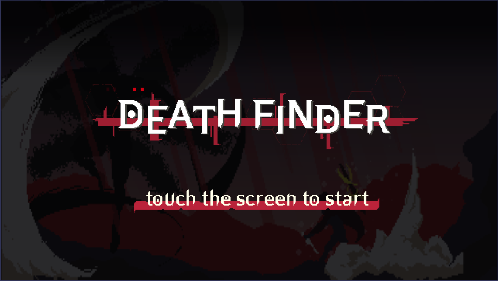
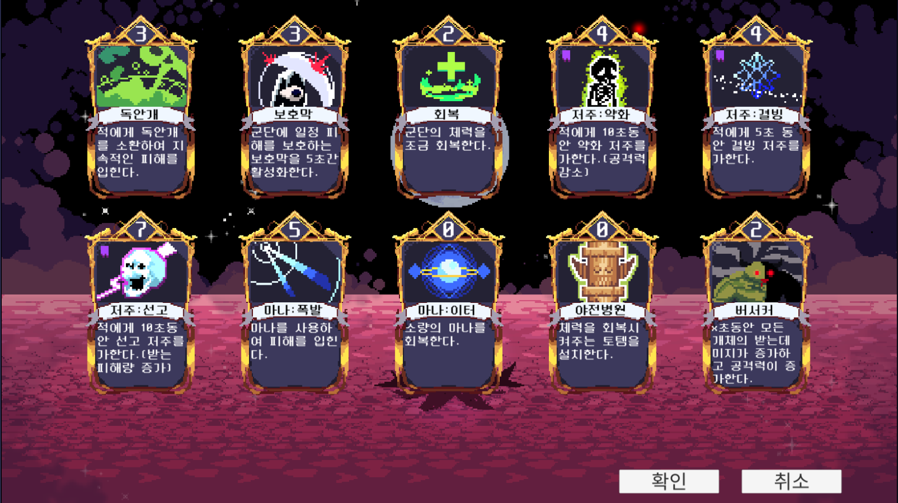
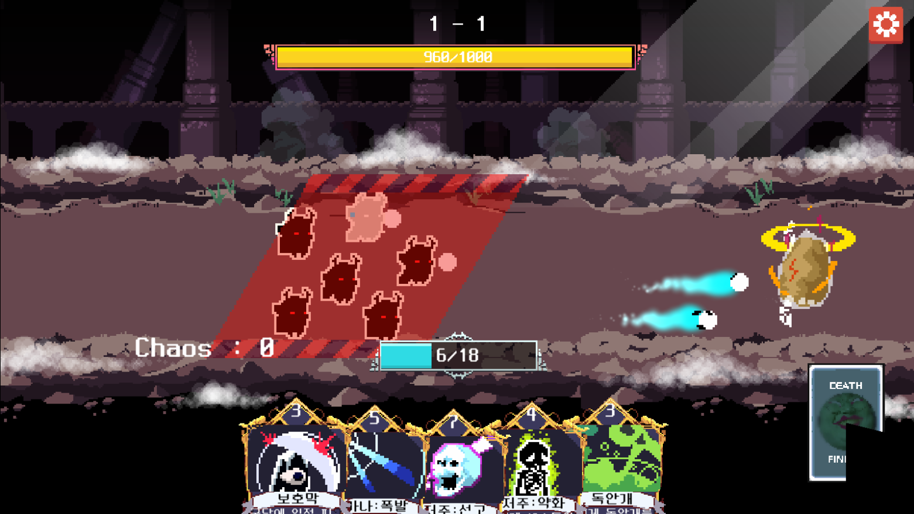

# DeathFinder
 이 프로젝트는 인디게임팀 **PixelSilo**에서 개발하던 프로젝트입니다.   
 팀의 1인 프로그래머로 Unity엔진을 사용해 개발하였습니다.
 
 -----
### 어떤 게임인가

    게임명 :  DeathFinder
    타겟 플랫폼 : Android (미출시)
    사용언어, 엔진 : C#, Unity
    
 </img>
 </img>
 </img>
 
 게임 플레이 영상 :
 
 **승리 조건 : 상대 유닛의 상단체력을 전부 깎으면 승리하며, 다음 스테이지가 열립니다.**   
 **패배 조건 : 플레이어의 유닛들이 모두 전투불능이 되면 패배합니다.**
 
 **게임 방식**  
 > 원하는 카드를 덱에 넣어 전투 진행중에 사용하여 버프, 디버프를 주는 형식의 게임입니다.   
 > 아군 유닛은 자동적으로 공격을 하며 덱에 넣은 카드를 사용하여 전투에 도움을 줄 수 있습니다.   
 > 우측 하단 카드를 클릭하면 사용한 만큼의 카드를 덱에서 가져옵니다.   
 > 상대방은 일정 시간마다 범위 공격을 가하며 비어있는 전투 공간을 클릭해 아군 유닛을 이동시킵니다.   
 
------
### 사용한 유니티 기능
 * **애니메이션**
   * **Sprite Sheet**를 이용한 애니메이션 구현.
   * **Animatior Controller** 의 Transition 및 애니메이션 이벤트를 이용한 코드 구현
 * **URP(Universal Render Pipeline)**
   * 카드를 선택할 때의 간단한 Bloom효과를 위하여 사용
 * **LitJson**
   * LitJson을 이용한 데이터 관리.
   * 덱에 들어간 카드를 Save, Load 하기 위하여 사용.
 * **PlayerPrefs**
   * 유저의 스테이지 진행도 저장, 초기화.
 * **Touch Event, Drag Event**
   * 카드 드래그와 전투 지역 터치 기능이 서로 섞이지 않게 철저하게 관리.
  
